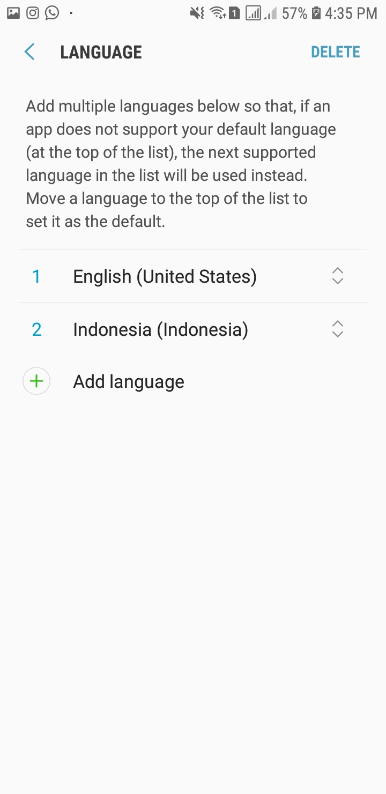
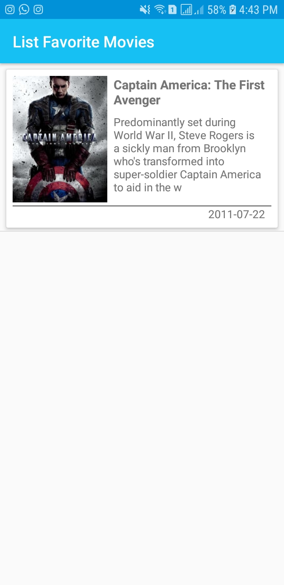
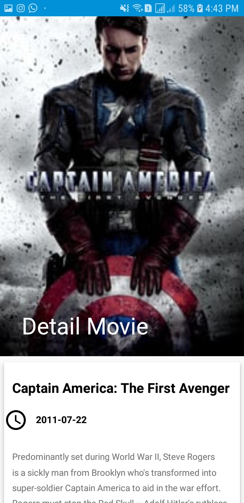

# Project Catalogue Movie Extended
Aplikasi katalog movie untuk submission terakhir beasiswa MADE (Menjadi Android Developer Expert) dari Dicoding https://www.dicoding.com/academies/14/.

### Screenshots Aplikasi Pertama

<pre>
                                                                        
</pre>

### Screenshots Aplikasi Kedua (***New Module***)
<pre>
         
</pre>

### Screenshots Widget Setelah Menambahkan Favorit Movie
<pre>

</pre>

### Notes
Untuk fitur ***notification*** setelah diaktifkan akan muncul notifikasi untuk release film sesuai tgl release setiap jam 08:00 pagi dan akan ada notifikasi pengingat setiap jam 07:00 pagi hanya berlaku di sistem operasi </ ***Nouget*** untuk sistem operasi ***Oreo*** tidak akan muncul. Maybe next time akan saya edit untuk muncul di sistem operasi Oreo :D

### Persyaratan aplikasi

* [x] Tambahkan widget favorit movie dengan menggunakan StackWidget.
* [x] Tambahkan scheduler untuk :
1. Daily Reminder, mengingatkan untuk kembali ke catalog movie. Daily reminder harus selalu berjalan tiap jam 7 pagi.
2. Release Today Reminder, menampilkan film yang release hari ini. Release reminder harus selalu berjalan tiap jam 8 pagi.
* [x] Harus bisa menyesuaikan orientasi portrait dan landscape.
* [x] Harus bisa menjaga data yang sudah dimuat / ditampilkan.


### Petunjuk menjalankan source code aplikasi

Untuk menjalankan source code aplikasi ini, anda perlu registrasi API KEY dari www.themoviedb.org
kemudian memasukkan API KEY yang telah didapat ke dalam file ***gradle.properties***

```
MovieDbApiKey="Masukan API KEY anda disini"
```

Kemudian tambah baris berikut pada file ***build.gradle*** dibawah ***buildTypes***

```
buildTypes.each {
        it.buildConfigField 'String', 'MOVIE_DB_API_KEY', MovieDbApiKey
    }
```

## Author

* **R Rifa Fauzi Komara**

Jangan lupa untuk follow dan ★
